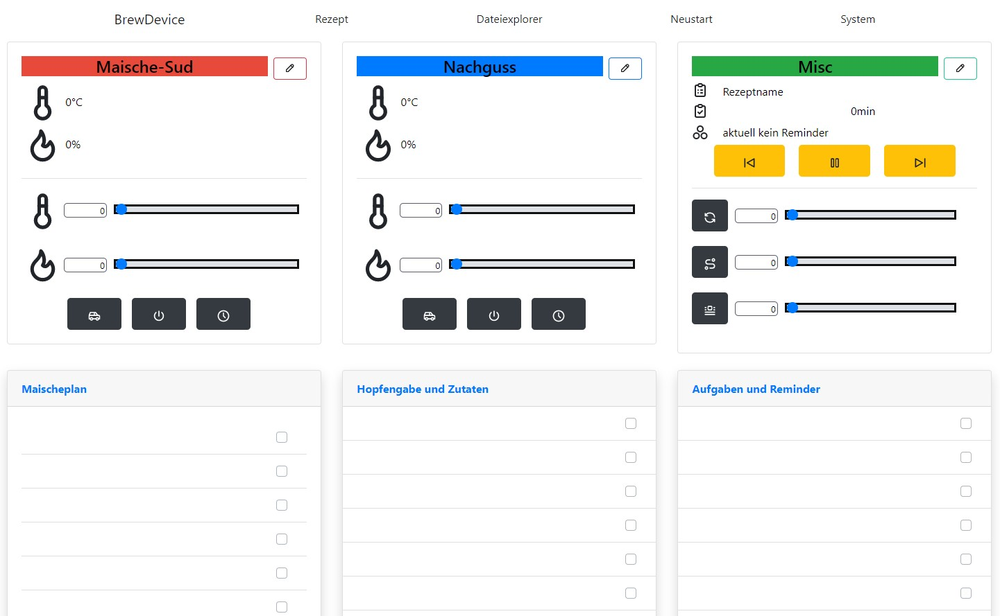

# BrewDevice

Das Projekt ist aktuell eingestellt. Der Sketch ist nicht fertiggestellt oder gebrauchstauglich!

BrewDevice ist ein Arduino Sketch für die Module ESP8266 Wemos D1 mini. BrewDevice ist eine Brausteuerung. Brewdevice steuert folgende Geräte:

- Induktionskochfeld GGM IDS2
- Temperatursensoren DS18B20 (1x MaischeSud, 1x Nachguss)
- Aktor für den Nachguss
- Aktor für ein Rührwerk
- Aktor für eine Pumpe
- Aktor für eom Ringheizelement
- Piezzo Buzzer

BrewDevice unterstützt den Import von Braurezepten aus

- KleinerBrauhelder2
- MaischeMalzundMehr

BrewDevice kann im Automatik-Modus brauen (auf einem Rezept) oder im Modus manuell. Der Automatik-Modus fährt die Rasten automatisch an und arbeitet ein Rezept von oben nach unten ab. Im manuellen Modus hat der Brauer die volle Kontrolle über jeden Schritt.
Der Automatik-Modus bietet sich für das Infusionsverfahren an. Der manuelle Modus bietet sich für Kochmaische Verfahren an.

## Dokumentation

## Sketch Information

Bibliotheken: (Stand ab Version 1.000, 01.2021)

- ESP8266 2.7.4 (SPIFFS)
- Arduino IDE 1.8.13
- Visual Code 1.52.1
- PubSubClient 2.8.0
- ArduinoJSON 6.17
- InfluxDB 3.6
- WiFiManager 2.0

Board Konfiguration:
Flash size 4MB (FS:2MB OTA:~1019kB)
SSL support all SSL ciphers (most comp)
Exceptions Lagacy
IwIP variant v2 lower mem

Debug Ausgabe:
Für Debug Ausgaben den Debug Port auf Serial einstellen. Für spezielle Debug Ausgaben entsprechend den Debug Level verwenden (default none).
